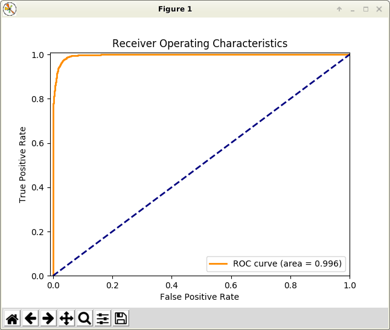
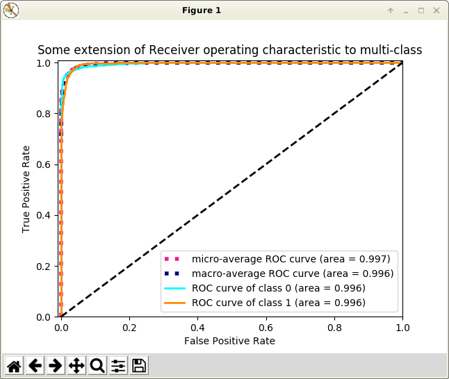

# caffe-roc-curves
Pyhton layer for the Caffe [Caffe](https://github.com/BVLC/caffe) deep learning framework to compute the accuracy and plot the receiver operating characteristic(ROC) curves.
This layer will plot the ROC curves of the TEST predictions after the TEST set of each test_iter have been processed. It will also work as an accuracy layer, providing Caffe with the predictions accuracy on the TEST set.

The is used as an accuracy layer in the prototxt file like:
	
	layer {
	  type: 'Python'
	  name: 'py_accuracy'
	  top: 'py_accuracy'
	  bottom: 'ip2'
	  bottom: 'label'
	  python_param {
	    # the module name -- usually the filename -- that needs to be in $PYTHONPATH
	    module: 'python_roc_curves'
	    # the layer name -- the class name in the module
	    layer: 'PythonROCCurves'
	    # a set of parameters, incl:
	    # test_iter: number of iterations the ROC plotting is triggered
	    # show: yes to show ROC plot in every test_iter iterations
	    # savefig: the ROC plot can be stored into image files with this parameter as the file name prefix.
	    # figformat: file name extension as the format. 
	    param_str: '{"test_iter":100, "show": "yes", "savefig": "result", "figformat", "png"}'
	  }
	  include {
	    phase: TEST
	  }
	}

## Examples of Binary Classification

## Examples of Multi-class Classification

